# Architecture

This page describes the high-level architecture of Glimpse and the main ownership boundaries between the frontend and backend.

## Overview

Glimpse is a Tauri desktop app.

1. React frontend: owns user interaction, rendering, preview tabs, internal pages, and trusted plugin execution.
2. `src/api/*` wrappers: provide typed frontend calls around Tauri IPC commands.
3. Tauri IPC commands: expose backend entrypoints to the frontend.
4. Rust backend services: own persistence, indexing, search, filesystem access, plugin installation, and command safety checks.
5. SQLite index / filesystem / `settings.json`: store searchable data, source files, and user configuration locally.

The frontend owns interaction, rendering, preview tabs, internal pages, and trusted plugin execution. The backend owns persistence, indexing, search, filesystem access, plugin installation, and command safety checks.

## Frontend Responsibilities

The frontend is responsible for:

- search input parsing and keyboard interaction
- result list rendering
- preview tabs and preview mode switching
- internal pages such as Settings, About, Help, Debug, and Plugins
- invoking typed wrappers in `src/api/`
- loading trusted plugin code and styles
- rendering plugin pages and viewers through the plugin component API

The frontend should not access the filesystem directly. It should go through Tauri commands or plugin runtime APIs that enforce the appropriate scope.

## Backend Responsibilities

The backend is responsible for:

- Tauri IPC command handlers
- application state initialization
- SQLite storage
- Tantivy search index management
- filesystem scans and file watching
- parser dispatch
- settings persistence and settings watcher
- plugin install, discovery, trust, and source loading
- command security policy
- safe path handling and item actions

Backend commands should return domain-shaped data that the frontend can render without duplicating backend decisions.

## Startup Flow

1. Tauri bootstrap: starts the app and prepares shared state.
2. Resolve app paths: locates app data, default workspace, and related local paths.
3. Initialize database and stores: opens SQLite-backed storage and runtime stores.
4. Load settings: reads and normalizes persisted settings.
5. Initialize current target group artifacts: prepares the active target group's local search artifacts.
6. Start indexing watcher: begins scan/watch coordination for the active scope.
7. Expose IPC commands: registers the command surface used by the frontend.
8. Frontend loads settings, stats, internal items, plugins, and first results: hydrates the initial UI state.

The frontend then loads settings, indexing stats, internal items, plugin manifests, and the first search result set.

## Search And Preview Flow

1. `SearchBar`: accepts user input and keyboard navigation.
2. `parseSearchInput`: extracts UI prefixes, tags, hidden/global flags, and command arguments.
3. `searchApi.getItems`: sends the structured request through the frontend API wrapper.
4. `search_items`: runs the backend search command.
5. Search engine: returns matching item IDs and scores from the active search backend.
6. SQLite hydration: loads canonical item metadata, preview payloads, and item actions.
7. `ItemList` and Preview: render results and load the selected preview.

Preview payloads are stored with indexed items. Search hits are hydrated from the canonical SQLite item store before being returned to the frontend.

## Indexing Flow

1. Target Group paths: define the filesystem scope to index.
2. Scan or watcher event: starts indexing from a full scan, incremental scan, or file change.
3. Parser dispatch: chooses the parser for each source file.
4. `IndexItem[]`: represents parsed searchable records.
5. SQLite item store: persists canonical item metadata and preview payloads.
6. Tantivy derived index: stores rebuildable full-text search data.
7. Indexing stats: exposes progress and diagnostics to the frontend.

SQLite is the canonical item store. Tantivy is a rebuildable full-text index derived from SQLite and source files.

Only `.gjson` files are parsed as Glimpse JSON indexes. Regular `.json` files are sent to the raw parser.

## Plugin Flow

1. Plugin folder: contains the local plugin bundle.
2. Manifest validation: checks plugin metadata, entrypoints, and capabilities.
3. Install into app data: copies accepted plugin files into managed storage.
4. Trust fingerprint: records the user-approved file fingerprints.
5. Frontend source loading: serves trusted source files to the frontend.
6. Runtime registration: activates plugin modules and registers contributions.
7. Pages, actions, viewers: exposes plugin-provided UI and commands.

The backend does not execute plugin JavaScript. It validates manifests, stores plugin files, checks trust, and serves trusted source to the frontend.
