# Indexing

Indexing turns files and generated records into searchable `IndexItem` values.

## Responsibilities

Indexing is responsible for:

- scanning target group paths
- watching for filesystem changes
- dispatching parsers
- upserting parsed items into SQLite
- updating derived search indexes
- removing stale items
- tracking indexing progress and diagnostics

## Key Modules

```text
src-tauri/src/store/indexer/
|-- mod.rs
|-- runtime.rs
|-- scan.rs
|-- watch.rs
`-- parser_dispatch.rs

src-tauri/src/store/parser/
```

The indexer coordinates scanning and watching. Parser modules convert source files into `IndexItem` values.

## Flow



1. Target Group: defines the active filesystem scope and the local `.glimpse/` artifacts used for indexing.
2. Scan / Watch: starts indexing from a full scan, incremental scan, or filesystem change.
3. Parser Dispatch: selects the parser based on source file type and indexing rules.
4. Parser: converts one source file into zero or more searchable items.
5. `IndexItem`: provides the searchable item with title, metadata, preview, and open-action data.
6. Search Engine: updates the SQLite item store and derived search index so items are available to search.

SQLite commits happen before derived search index updates. If the derived index becomes stale, a full scan can rebuild it.

## Supported Parsers

Current parser categories include:

- Markdown parser
- Glimpse JSON parser
- metadata-only file parser
- raw file parser
- image metadata parser

Parser selection is based on source file type and configured indexing rules.

## Indexing Filter

Indexing filters decide which files should be parsed.

Filters should account for:

- target group paths
- ignored folders
- supported extensions
- hidden or system files
- generated `.glimpse/` artifacts

Generated search artifacts must not be recursively indexed as normal user content.

## Target Groups

A Target Group defines the active filesystem scope. Each group can have its own local search artifacts under the primary target directory.

Switching target groups should switch the active SQLite connection, active search runtime, and watcher state without requiring a full scan when valid artifacts already exist.

## Source Identity

The indexer tracks source identity so updates can replace all items derived from the same source file.

This matters for `.gjson` files because one source file can produce multiple searchable items. When a `.gjson` file changes, stale sub-items must be removed if the item list shrinks.
