# Settings

Settings describe user preferences, target groups, indexing behavior, command policy, experimental flags, and plugin trust records.

## Model

The settings model is shared through backend models and frontend types.

Settings include:

- UI preferences
- theme selection
- target groups
- indexing options
- command settings
- experimental settings
- plugin trust records

Frontend settings screens should read and write settings through `src/api/settings.ts`.

## Defaults

Default settings are created during first launch or when a settings file is missing.

Defaults should provide a working local setup without requiring manual configuration before the user can search or preview content.



1. First launch: starts with no guaranteed persisted settings.
2. Create default workspace: prepares the initial local workspace.
3. `settings.json` exists?: checks whether settings are already present.
4. Create `settings.json`: writes a missing settings file.
5. Create: records the default Target Group and initial values.
6. Normalize loaded settings: fills missing fields and repairs invalid values where possible.
7. Search-ready local setup: leaves the app ready to search local content.

## Target Groups

Target Groups define searchable filesystem scopes.

Each target group can include one or more paths. The active target group controls normal search, indexing, and watcher state.

Global search can include multiple active target groups when requested by the user.

## Indexing Settings

Indexing settings control what files are scanned and watched.

They can affect:

- included folders
- ignored folders
- file extensions
- hidden item behavior
- startup scan behavior

Indexing settings must stay consistent with both the indexer and the Settings UI.

## Command Settings

Command execution is controlled by command settings.

Relevant settings include:

- allowed commands
- blocked commands
- trusted directories
- command history behavior

Backend command execution must enforce these settings before running a command.

## Experimental Settings

Experimental settings can gate behavior that is not yet considered stable.

When adding an experimental setting, document:

- what it changes
- whether restart is required
- what part of the UI exposes it
- how it should be removed or promoted later

## Plugin Trust

Plugin trust records are stored in settings.

```text
plugins.trustedPlugins
```

Trust is tied to plugin id, version, and file fingerprints. Installing, replacing, uninstalling, or changing plugin files invalidates trust.

## Settings Watcher

The settings watcher keeps backend runtime state aligned with persisted settings.

Settings changes can trigger:

- target group switching
- watcher restart
- indexing runtime updates
- plugin state updates
- UI refresh through frontend polling or reload



1. `settings.json` change: detects a persisted settings update.
2. `settings_watch.rs`: observes the file and coordinates backend reactions.
3. `settings-changed` event: notifies the frontend that settings changed.
4. Target Group switch: updates active search scope when the current group changes.
5. Plugin state update: refreshes plugin trust, enablement, and source availability.
6. Frontend refresh: reloads settings-dependent UI state.
7. Indexer and watcher update: restarts or retargets backend indexing work when needed.
