# Search

Glimpse updates both the search results and the Preview panel in real time as you type.

There is no search button to click. Type a few characters, move through the results with the keyboard, and use the Preview panel to confirm the item before opening it.

## Basic Workflow



1. Type a query: enter a few characters in the search bar.
2. Search Results: review the live result list.
3. Live Preview: inspect the selected item without opening it.
4. Preview Tabs: pin useful previews so they stay open.
5. Continue searching: keep refining the query or switch targets.

When you select a search result, the Preview panel updates automatically.

Once you find a document you want to keep open, use the configured `Add Preview Tab` shortcut to pin it as a Preview Tab and continue searching.
The default is `Ctrl + T`, but the shortcut can be changed in Settings.

## Standard Search

```text
rust
```

Standard search matches titles, body text, tags, aliases, and other indexed text.

Examples of searchable sources include:

- Markdown files
- `.gjson` index entries
- Images and metadata-only file references
- Raw file previews
- Built-in Internal Pages
- Trusted plugin pages and actions

## Live Preview

Selecting a search result updates the Preview panel without opening another application.

```text
Search Results       Preview

Rust          ->      Rust.md
Markdown      ->      Markdown.md
Commands      ->      Commands.md
```

This makes it easier to confirm the right item before opening the source file, external URL, command, or plugin action.

## Preview Tabs

To keep the current preview open, press:

```text
Ctrl + T
```

The current preview is added as a Preview Tab. The Live Preview continues to follow the selected search result, while Preview Tabs remain open until you close them.

## Search Syntax

The search bar supports several prefixes.

| Input                        | Description                                |
| ---------------------------- | ------------------------------------------ |
| `rust`                       | Search the current Target Group            |
| `#rust`                      | Search by tag                              |
| `!rust`                      | Search hidden items                        |
| `*rust`                      | Search unstarred items                     |
| `*`                          | Browse unstarred items                     |
| `:settings`                  | Search Internal Pages                      |
| `/plugin`                    | Search plugin playground pages             |
| `numeric calculator > 1 + 2` | Pass arguments to the selected page/action |

For the full syntax, see [Query Syntax](../search/syntax.md).

## Internal Pages

Use `:` to search Internal Pages.

```text
:settings
:help
:plugin
```

Internal Pages appear in the result list and can be previewed like documents.

## Target Groups

Search sources can be organized into Target Groups. For example, you might create separate groups such as Work, Personal, and Study.

Press `Ctrl + R` to switch to the next Target Group while keeping the current search query.

## Search Tips

1. Type a few characters into the search bar.
2. Move through results with the arrow keys.
3. Review items using Live Preview.
4. Press `Ctrl + T` for documents you want to keep open.
5. Use `Ctrl + R` when the item may be in another Target Group.
