# アーキテクチャ

Glimpse は React、TypeScript、Rust、SQLite、Tauri で構成された local-first のデスクトップ検索ランチャーです。

主な設計目標は、検索、プレビュー、item action を高速に保ちつつ、ローカルファイルとプラグインコードをユーザーの明示的な管理下に置くことです。

## 全体像


1. UI、preview tabs、Internal Pages、trusted plugin runtime を担当します。
2. frontend から Tauri IPC command を呼ぶ typed boundary です。
3. frontend request を Rust backend services の entrypoint に渡します。
4. Rust backend services: app state、search/indexing、parser、plugin 管理、安全境界を担当します。
5. SQLite index / filesystem / `settings.json`: 検索対象、永続化データ、ユーザー設定の local source of truth です。

## フロントエンドの責務

フロントエンドは次を担当します。

- 検索入力の解析
- 検索結果リストの描画
- Live Preview と Preview Tabs
- Internal Pages
- 設定 UI
- プラグイン runtime の有効化
- プラグインが提供する page、action、viewer の描画と実行
- キーボードショートカットの dispatch

重要なディレクトリ:

```text
src/api
src/components
src/features
src/hooks
src/views
src/types
```

フロントエンドの各モジュールは、コンポーネントから直接 `invoke()` を呼ばず、原則として `src/api/*` のラッパー経由でバックエンドコマンドを呼び出します。

## バックエンドの責務

Rust バックエンドは次を担当します。

- Tauri command entrypoint
- app data path の解決
- default workspace と settings の作成
- SQLite schema と search repository
- ファイルシステムの scan と watch
- parser dispatch
- command security policy
- プラグインの install、discovery、trust、source loading
- Target Group または active-tab scope で制限された file read

重要なディレクトリ:

```text
src-tauri/src/commands
src-tauri/src/models
src-tauri/src/search
src-tauri/src/store
src-tauri/src/utils
```

## 起動フロー

`src-tauri/src/lib.rs` がアプリケーションを組み立てます。


1. Tauri bootstrap: アプリを起動し、共有 state を準備します。
2. Resolve app paths: app data、default workspace、関連する local path を解決します。
3. Initialize database and stores: SQLite-backed storage と runtime store を初期化します。
4. Load settings: 保存済み settings を読み込み、正規化します。
5. Initialize current target group artifacts: current Target Group の local search artifact を準備します。
6. Start indexing watcher: active scope の scan/watch coordination を開始します。
7. Expose IPC commands: frontend が使う command surface を登録します。
8. Frontend loads settings, stats, internal items, plugins, and first results: 初期 UI state を読み込みます。

その後、frontend は settings、indexing stats、Internal Pages、plugin manifests、最初の検索結果を読み込みます。

## 検索とプレビューの流れ



1. user input と keyboard navigation を受け取ります。
2. UI prefix、tags、hidden/global flags、command args を抽出します。
3. frontend API wrapper 経由で structured request を送ります。
4. backend search command を実行します。
5. active search backend から matching item IDs と scores を返します。
6. canonical item metadata、preview payload、item action を読み込みます。
7. 検索結果を描画し、選択中 item の preview を読み込みます。

parsed query が `:` または `/` で始まる場合、Internal Page search はフロントエンドで処理されます。

## インデックス作成の流れ


1. Target Group paths: indexing 対象の filesystem scope を決めます。
2. Scan or watcher event: full scan、incremental scan、file change から indexing を開始します。
3. Parser dispatch: source file ごとに parser を選択します。
4. `IndexItem[]`: parser が生成した検索可能 record です。
5. SQLite item store: canonical item metadata と preview payload を保存します。
6. Tantivy derived index: 再構築可能な full-text search data を保存します。
7. Indexing stats: frontend に progress と diagnostics を公開します。

Glimpse JSON index として解析されるのは `.gjson` ファイルだけです。通常の `.json` ファイルは raw parser に渡されます。

## プラグインの流れ


1. Plugin folder: local plugin bundle を含みます。
2. Manifest validation: plugin metadata、entrypoint、capability を検証します。
3. Install into app data: 受け入れた plugin file を managed storage にコピーします。
4. Trust fingerprint: user が承認した file fingerprint を記録します。
5. Frontend source loading: trusted source file を frontend に提供します。
6. Runtime registration: plugin module を activate し、contribution を登録します。
7. Pages, actions, viewers: plugin が提供する UI と command を公開します。

バックエンドはプラグイン JavaScript を実行しません。manifest の検証、ファイルの保存、trust の確認を行い、trust 成功後に source をフロントエンドへ渡します。
