# フロントエンド

フロントエンドは `src` 配下の React と TypeScript で実装されています。

メインの検索フロー、preview UI、settings UI、keyboard shortcut、Internal Pages、plugin runtime を担当します。

## ソース構成

```text
src/
|-- api/
|-- components/
|-- contexts/
|-- features/
|-- hooks/
|-- i18n/
|-- styles/
|-- types/
|-- utils/
`-- views/
```

## メインアプリケーションの流れ

`src/App.tsx` が launcher を調整します。



- (1) prefix、tags、command args、routing hints を解析する
- (2) query を frontend Internal Page search で処理するか判定する
- (3a) built-in または plugin 提供の internal page item を返す
- (3b) 通常検索 request を backend に送る
- (4) 検索結果と selected item state を描画する
- (5) 選択中 item の preview content を読み込む
- (6) `usePreviewTabs`: Live Preview と固定された Preview Tabs を管理する

Global shortcuts は `useShortcuts` と `createAppShortcuts` で登録されます。shortcut event はメインフローの手順ではなく、検索入力や Preview Tabs に対して補助的に作用します。

## API Layer

フロントエンドコードは `src/api` の wrapper を使います。

重要な wrapper:

- `searchApi`
- `settingsApi`
- `fileApi`
- `previewApi`
- `pluginsApi`
- `commandApi`
- `openerApi`
- `indexingApi`
- `themesApi`

コンポーネントは、同時に wrapper を追加する場合を除き、Tauri の `invoke()` を直接呼ばないようにします。

## 検索入力の解析

`parseSearchInput` は次を返します。

- `query`
- `tags`
- `commandArgs`
- `global`
- `hidden`

prefix の挙動:

- `!` は hidden item を検索する。
- `#tag` は tag filter になる。
- `>` は検索部分と引数を分割する。
- `:` は built-in と plugin の Internal Pages を検索する。
- `/` は plugin playground pages を検索する。

## プレビュー

preview type は `src/types/item.ts` で表現されます。

- `markdown`
- `raw`
- `external`
- `pluginViewer`
- `internal`

画像は現在、独立した `image` preview type ではなく、image syntax を含む Markdown preview として表現されます。バックエンドは保存済み preview を返し、フロントエンドが描画方法を決めます。

## プラグイン

フロントエンド側の plugin code は `src/features/plugins` 配下にあります。

バックエンドは manifest を検証し、trusted source を提供します。フロントエンドは次を行います。



1. Enabled plugin manifests: frontend から見える plugin declaration を読み込みます。
2. Check trust status: plugin file が承認済み fingerprint と一致するか確認します。
3. Load trusted source: trusted plugin entrypoint code を取得します。
4. Activate plugin modules: frontend runtime で plugin activation を実行します。
5. Inject trusted styles: trusted plugin CSS を追加します。
6. Register pages, actions, and viewers: plugin contribution を registry に登録します。
7. Render plugin components: component API 経由で plugin UI を描画します。

プラグインは React を直接 import せず、Glimpse が提供する component を通じて描画します。
