# プラグイン

Glimpse plugin はローカルのフロントエンド専用 bundle で、次の場所に install されます。

```text
<app_data_dir>/plugins/<plugin-id>/
```

バックエンドは manifest の検証、plugin folder の copy、trust の管理、trusted source file の提供を行います。フロントエンドは plugin JavaScript を有効化し、plugin contribution を描画します。

## フォルダ構成

```text
plugin-root/
|-- manifest.json
|-- main.js
|-- page.js        optional
`-- styles.css     optional
```

## Manifest

```json
{
  "id": "first-glimpse-plugin",
  "name": "First Glimpse Plugin",
  "version": "0.1.0",
  "apiVersion": "0.1.0",
  "description": "A sample plugin.",
  "enabledByDefault": true,
  "entrypoints": {
    "main": "./main.js",
    "page": "./page.js"
  },
  "capabilities": {
    "files": {
      "read": "none"
    }
  },
  "contributes": {
    "internalPages": [
      {
        "id": "plugin:first-glimpse-plugin",
        "title": "First Glimpse Plugin",
        "tags": ["internal", "plugin"],
        "aliases": ["first"],
        "pageAction": {
          "actionId": "hello",
          "inputPlaceholder": "Name"
        }
      }
    ],
    "actions": [
      {
        "id": "hello",
        "title": "Say hello"
      }
    ],
    "viewers": [
      {
        "id": "csv",
        "title": "CSV Viewer",
        "extensions": ["csv"]
      }
    ]
  }
}
```

## Manifest ルール

- `id`, `name`, `version` は必須です。
- `version` は semantic version triplet である必要があります。
- `apiVersion` の default は `0.1.0` です。
- 対応している plugin API version は `0.1.0` です。
- `id` は install 先の plugin directory name と一致する必要があります。
- entry path は plugin root の内側に収まる必要があります。
- backend declaration は拒否されます。
- Internal Page id は `plugin:<plugin-id>` で始まる必要があります。
- action id と viewer id は path ではなく plain id にします。

## Trust

Glimpse が `main.js`、`page.js`、`styles.css` をフロントエンドへ提供する前に、plugin は trust されている必要があります。

trust は次に紐づきます。

- plugin id
- plugin version
- `manifest.json`、`main.js`、optional `page.js`、optional `styles.css` の SHA-256 fingerprint

trust が取り消される条件:

- plugin を install した
- plugin を replace した
- plugin を uninstall した
- plugin file が変わった
- plugin version が変わった



1. 以前の trusted state を無効化する
2. plugin file や lifecycle state が変わったときに trust を取り消す
3. user が plugin を確認し、承認するか判断する
4. 承認済み file fingerprint を保存する
5. trusted source file を frontend が読めるようにする
6. plugin runtime code を読み込みます。
7. trusted contribution を UI で使えるようにする

## IPC Commands

backend plugin commands:

- `get_plugin_manifests`
- `get_plugin_discovery_report`
- `install_plugin_from_path`
- `uninstall_plugin`
- `get_plugin_trust_status`
- `set_plugin_trust`
- `get_plugin_entrypoint_source`
- `get_plugin_asset_source`
- `open_plugins_folder`

フロントエンドからは `src/api/plugins.ts` 経由でアクセスします。

## Runtime API

`main.js` は activation function を export します。

```js
export default function activate(ctx) {
  ctx.registerAction("hello", (input = "Glimpse") => {
    return `Hello, ${String(input).trim() || "Glimpse"}!`;
  });

  ctx.registerPage("plugin:first-glimpse-plugin", ({ h, components }) => {
    const { Stack, Section, Button, Input, Text } = components;

    return h(
      Stack,
      { gap: "md" },
      h(Text, null, "Rendered by a trusted plugin."),
      h(
        Section,
        { title: "Action" },
        h(Button, { action: "hello", input: "Glimpse" }, "Run"),
        h(Input, {
          action: "hello",
          placeholder: "Name",
          submitLabel: "Greet"
        })
      )
    );
  });
}
```

利用できる context:

- `ctx.registerAction(id, handler)`
- `ctx.registerPage(id, render)`
- `ctx.registerViewer(id, render)`
- `ctx.actions.invoke(id, input)`
- `ctx.files.readText(path)`
- `ctx.files.readBinary(path)`
- `ctx.files.getMetadata(path)`
- `ctx.files.toAssetUrl(path)`
- `ctx.log.info/warn/error`
- `ctx.components`
- `ctx.h`
- `ctx.plugin.id`
- `ctx.api.version`
- `ctx.math`

## コンポーネント

plugin は Glimpse component を通じて描画します。

- `Stack`
- `Text`
- `Section`
- `KeyValueList`
- `Button`
- `Input`
- `Table`
- `Tabs`
- `List`
- `Details`
- `Markdown`
- `DeferredFrame`
- `FileOpenButton`
- `ActionPlayground`
- `CalculationPanel`

plugin は React を直接 import しないでください。

## ファイル読み取りスコープ

plugin の default は file read access なしです。

対応 scope:

| Scope | Behavior |
| ----- | -------- |
| `none` | file read なし |
| `active-tab` | viewer render 開始時に active だった file だけを読める |
| `target-group` | current Target Group 配下の file を読める |

viewer plugin は通常 `active-tab` を使います。より広い `target-group` access は、cross-file read が本当に必要な機能に限定してください。

## 提供機能

plugin が提供できるもの:

- 検索可能な Internal Pages
- actions
- file extension 用 viewers
- static page content
- page actions
- help content
- `i18n` による localized labels

plugin action は検索可能 item として表示でき、`>` から引数を受け取れます。

## サンプル

sample plugin は `plugins/` にあります。

- `first-glimpse-plugin`
- `numeric-calculator-plugin`
- `date-calculator-plugin`
- `unit-converter-plugin`
- `pdf-viewer-plugin`
- `csv-viewer-plugin`
- `office-documents-viewer-plugin`

Plugin Page で plugin folder の absolute path を入力し、trust と enable を行って install します。
